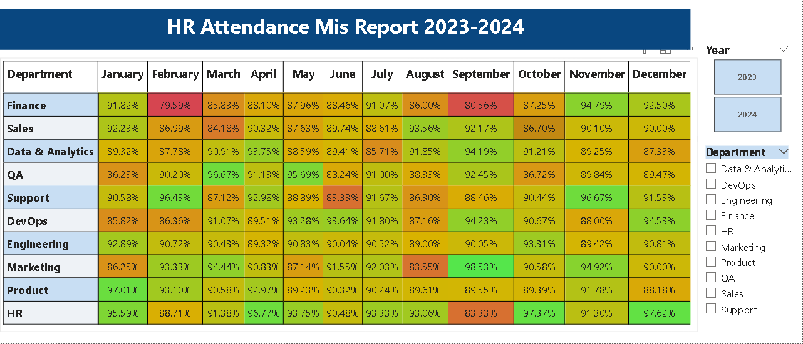

# HR Attendance Analytics Dashboard | Power BI

## Project Overview
Developed a two-page interactive HR Attendance Analytics Dashboard in Power BI to help HR teams monitor employee attendance, identify absenteeism risks, and analyze department-wise performance across 2023-2024.

## Dashboard Preview

### Page 1 — HR Attendance Dashboard


### Page 2 — MIS Report


## Tools & Technologies
- **Visualization:** Power BI Desktop
- **Data Transformation:** Power Query
- **Calculations:** DAX (Data Analysis Expressions)

## Dataset
- 499 employees across 10 departments
- 2 years of attendance data (2023-2024)
- Fields: Employee ID, Department, Date, Attendance Status, Check-in/Check-out Time, Shift

## Page 1 — HR Attendance Dashboard
| Visual | Description |
|--------|-------------|
| KPI Cards | Total Employees, Avg Working Hours, Absenteeism Rate %, Attendance Rate % |
| Bar Chart | Attendance Rate % by Department |
| Donut Chart | Employee Attendance Status Breakdown |
| Column Chart | Total Absent Days by Department (with drill-down) |
| Line Chart | Attendance Trend by Month — 2023 vs 2024 comparison |
| Table | Lowest Attendance Employees |
| Slicers | Department, Month, Shift |

## Page 2 — MIS Report
| Feature | Description |
|---------|-------------|
| Matrix | Department-wise monthly Attendance Rate % |
| Conditional Formatting | Red (low) → Yellow → Green (high) |
| Slicers | Year, Department |

## DAX Measures
```DAX
Attendance Rate % = 
DIVIDE(
    CALCULATE(COUNTA('Attendance Log'[Status]), 'Attendance Log'[Status] = "Present")
    + CALCULATE(COUNTA('Attendance Log'[Status]), 'Attendance Log'[Status] = "Late")
    + CALCULATE(COUNTA('Attendance Log'[Status]), 'Attendance Log'[Status] = "Half Day") * 0.5,
    COUNT('Attendance Log'[Employee_ID])
)
```
